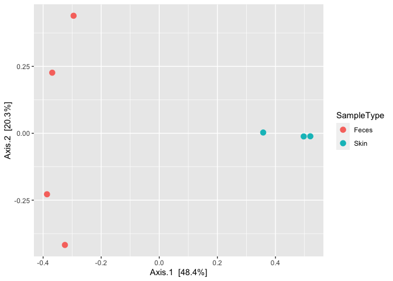

<!-- README.md is generated from README.Rmd. Please edit that file -->

# subsamplePhyloseq

<!-- badges: start -->
<!-- badges: end -->

This package allows for the **repeated subsampling** of an existing
phyloseq object as described in [Schloss
2023](https://www.biorxiv.org/content/10.1101/2023.06.23.546312v1) and
the averaging of common alpha- and beta-diversity metrics across the
subsamples (i.e., perform rarefaction). The repeated
subsampling/rarefaction provides an approach to control for uneven
sequencing effort for the alpha- and beta-diversity metrics returned. A
list of subsampled phyloseq objects is also returned allowing for
additional metrics to be computed and averaged across the subsamples as
required. Parallel computation is implemented using the doParallel and
foreach packages.

## Installation

You can install the development version of subsamplePhyloseq from
[GitHub](https://github.com/) with:

``` r
# install.packages("devtools")
devtools::install_github("Nick243/subsamplePhyloseq")
```

## Example

This basic example highlights the core functionality of the
subsamplePhyloseq package. First, an example phyloseq object is obtained
from the phyloseq package. Then the subsample_phyloseq() function is run
to perform the repeated subsampling and averaging of diversity metrics.
Finally, an example ordination is performed on the average Bray-Curtis
dissimilarity.

Larger values for the depth of subsampling and number of repeats should
be used when analyzing data from an actual experiment.

Run parallel::detectCores() to determine the number of available cores.
For projects with a large number of samples or library sizes consider
using using parallel::detectCores() - 1.

``` r
library(subsamplePhyloseq)
library(phyloseq)
library(ggplot2)

#Create example data
data("GlobalPatterns")
ps <- phyloseq::subset_samples(GlobalPatterns, SampleType %in% c("Feces", "Skin"))
ps <- phyloseq::subset_taxa(ps, phyloseq::taxa_sums(ps) > 0)

x <- phyloseq::taxa_sums(ps)
keepTaxa <- (x / sum(x)) > 1e-3
ps <- phyloseq::prune_taxa(keepTaxa, ps)


#Repeatedly subsample phyloseq object
rep_ps <- subsample_phyloseq(ps_object = ps, repeats = 2, depth = 10000, n_cores = 2)
#> subsample_phyloseq() assumes taxa comprise the rows of the OTU table.
#>           If the function returns a distance matrix of taxa, and you wanted pairwise distances
#>           for each sample, then transpose the OTU table before running.
rep_ps
#> $ps_obj
#> phyloseq-class experiment-level object
#> otu_table()   OTU Table:         [ 131 taxa and 7 samples ]
#> sample_data() Sample Data:       [ 7 samples by 7 sample variables ]
#> tax_table()   Taxonomy Table:    [ 131 taxa by 7 taxonomic ranks ]
#> phy_tree()    Phylogenetic Tree: [ 131 tips and 130 internal nodes ]
#> 
#> $repeats
#> [1] 2
#> 
#> $subsample_depth
#> [1] 10000
#> 
#> $adiv
#> # A tibble: 7 × 6
#>   id      Observed Shannon Simpson InvSimpson Fisher
#>   <chr>      <dbl>   <dbl>   <dbl>      <dbl>  <dbl>
#> 1 F21Plmr       63    3.09   0.933      14.9    8.98
#> 2 M11Fcsw       80    2.86   0.894       9.43  11.9 
#> 3 M11Plmr       81    2.59   0.850       6.66  12.0 
#> 4 M31Fcsw       82    3.16   0.904      10.4   12.2 
#> 5 M31Plmr       58    2.88   0.877       8.14   8.07
#> 6 TS28          74    3.53   0.955      22.2   10.8 
#> 7 TS29          70    2.84   0.895       9.57  10.2 
#> 
#> $bray_curtis
#>         M31Fcsw M11Fcsw M31Plmr M11Plmr F21Plmr   TS28    TS29
#> M31Fcsw 0.00000 0.52250 0.99235 0.98650 0.99260 0.6328 0.78495
#> M11Fcsw 0.52250 0.00000 0.99695 0.99120 0.99630 0.7792 0.88725
#> M31Plmr 0.99235 0.99695 0.00000 0.81360 0.37305 0.9968 0.99610
#> M11Plmr 0.98650 0.99120 0.81360 0.00000 0.72905 0.9915 0.99150
#> F21Plmr 0.99260 0.99630 0.37305 0.72905 0.00000 0.9964 0.99585
#> TS28    0.63280 0.77920 0.99680 0.99150 0.99640 0.0000 0.61510
#> TS29    0.78495 0.88725 0.99610 0.99150 0.99585 0.6151 0.00000
#> 
#> $jaccard
#>           M31Fcsw   M11Fcsw   M31Plmr   M11Plmr   F21Plmr      TS28      TS29
#> M31Fcsw 0.0000000 0.2672769 0.7761831 0.5948276 0.7558971 0.2911836 0.3566503
#> M11Fcsw 0.2672769 0.0000000 0.8196286 0.6355932 0.7831016 0.3405213 0.3872572
#> M31Plmr 0.7761831 0.8196286 0.0000000 0.4526217 0.4037382 0.8087445 0.8145022
#> M11Plmr 0.5948276 0.6355932 0.4526217 0.0000000 0.4091353 0.6621682 0.6813396
#> F21Plmr 0.7558971 0.7831016 0.4037382 0.4091353 0.0000000 0.7922149 0.8018018
#> TS28    0.2911836 0.3405213 0.8087445 0.6621682 0.7922149 0.0000000 0.2500000
#> TS29    0.3566503 0.3872572 0.8145022 0.6813396 0.8018018 0.2500000 0.0000000
#> 
#> $horn
#>           M31Fcsw   M11Fcsw   M31Plmr   M11Plmr   F21Plmr      TS28      TS29
#> M31Fcsw 0.0000000 0.2473972 0.9975420 0.9980491 0.9976886 0.4212470 0.8941230
#> M11Fcsw 0.2473972 0.0000000 0.9984343 0.9990455 0.9988621 0.5911727 0.9410342
#> M31Plmr 0.9975420 0.9984343 0.0000000 0.8891424 0.2851142 0.9983959 0.9991628
#> M11Plmr 0.9980491 0.9990455 0.8891424 0.0000000 0.7811135 0.9982618 0.9987465
#> F21Plmr 0.9976886 0.9988621 0.2851142 0.7811135 0.0000000 0.9980488 0.9984439
#> TS28    0.4212470 0.5911727 0.9983959 0.9982618 0.9980488 0.0000000 0.5871055
#> TS29    0.8941230 0.9410342 0.9991628 0.9987465 0.9984439 0.5871055 0.0000000
#> 
#> $subsampled_list
#> $subsampled_list[[1]]
#> phyloseq-class experiment-level object
#> otu_table()   OTU Table:         [ 131 taxa and 7 samples ]
#> sample_data() Sample Data:       [ 7 samples by 7 sample variables ]
#> tax_table()   Taxonomy Table:    [ 131 taxa by 7 taxonomic ranks ]
#> phy_tree()    Phylogenetic Tree: [ 131 tips and 130 internal nodes ]
#> 
#> $subsampled_list[[2]]
#> phyloseq-class experiment-level object
#> otu_table()   OTU Table:         [ 131 taxa and 7 samples ]
#> sample_data() Sample Data:       [ 7 samples by 7 sample variables ]
#> tax_table()   Taxonomy Table:    [ 131 taxa by 7 taxonomic ranks ]
#> phy_tree()    Phylogenetic Tree: [ 131 tips and 130 internal nodes ]

#Generate example ordination
my_pcoa <- cmdscale(rep_ps$bray_curtis, eig = TRUE)
lab1 <- paste0("Axis.1  [", round(100 * my_pcoa$eig[1]/sum(my_pcoa$eig), 1), "%]")
lab2 <- paste0("Axis.2  [", round(100 * my_pcoa$eig[2]/sum(my_pcoa$eig), 1), "%]")

plot_ordination(ps, my_pcoa, type = "samples", color = "SampleType") +
    labs(x = lab1, y = lab2) +
    geom_point(size = 3)
```


